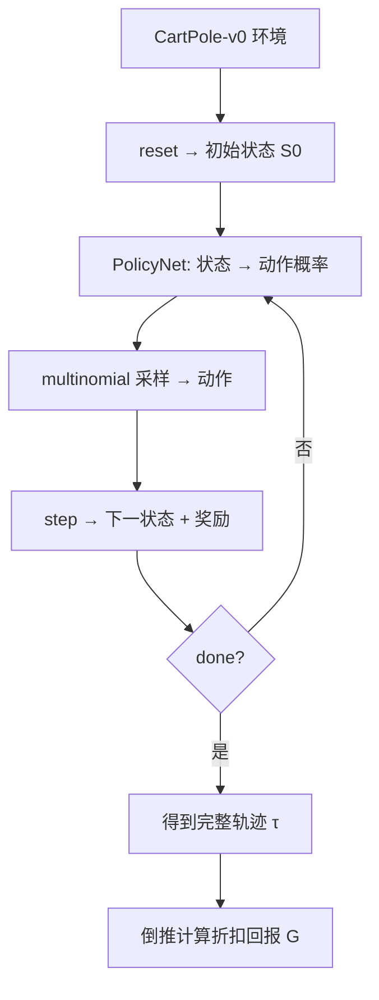

深度思考
```The user wants me to explain the code in `pendulum.py`. Let me analyze the selected code and explain it step by step.
```
这个文件是一个**强化学习入门教程**，以 `CartPole-v0`（小车倒立摆）环境为例，逐步演示了从环境交互到策略网络、再到轨迹采样和回报计算的完整流程。下面逐段讲解：

---

## 1. 环境交互（第 1–21 行）

```python
env = gym.make('CartPole-v0')
state = env.reset()
next_state, reward, done, _ = env.step(action)
```


- 创建 CartPole 环境，状态是一个 4 维向量（小车位置、速度、杆角度、角速度）。
- `reset()` 重置到初始状态 \(S_0\)。
- `step(action)` 执行动作后返回：下一个状态 \(S_{t+1}\)、即时奖励 \(R_t\)、是否结束 `done`。
- 这里手动执行了一个动作（向左推），演示了 MDP（马尔可夫决策过程）的基本交互循环。

---

## 2. 策略网络 `PolicyNet`（第 24–41 行）

```python
class PolicyNet(nn.Module):
    # 输入: 状态(4维) → 隐藏层(128) → 输出: 2个动作的概率
```


- 一个简单的两层全连接网络，定义了**策略** \(\pi_\theta(A_t | S_t)\)。
- 输入 4 维状态 → Linear(4, 128) → ReLU → Linear(128, 2) → **Softmax**。
- 输出是两个动作（向左 / 向右）的概率分布。

---

## 3. 智能体 `Agent`（第 50–95 行）

### 3.1 初始化
- `gamma = 0.98`：折扣因子，衡量未来奖励的重要性。
- `pi`：策略网络。
- `optimizer_pi`：Adam 优化器，学习率 0.001。

### 3.2 `get_action(state)` — 动作采样
```python
probs = self.pi(state).squeeze(0)
action = torch.multinomial(probs, num_samples=1).item()
```

- 将状态送入策略网络，得到动作概率分布。
- 用 `torch.multinomial` **按概率采样**（而非取 argmax），这是策略梯度方法的关键——保持探索性。

### 3.3 `rollout(env)` — 轨迹采样
```python
while not done:
    action = self.get_action(state)
    next_state, reward, done, _ = env.step(action)
    states.append(state), actions.append(action), rewards.append(reward)
```

- 让智能体在环境中完整玩一个回合（episode），收集一条**轨迹**：
  \[\tau = (S_0, A_0, R_0, S_1, A_1, R_1, \dots, S_T)\]

---

## 4. 折扣回报计算（第 104–113 行）

```python
G = 0.0
for r in rewards[::-1]:
    G = r + agent.gamma * G
```


- 从轨迹末尾**倒推**计算带折扣的累积回报：
  \[G_t = R_t + \gamma \cdot G_{t+1}\]
- 最终 \(G_0 = R_0 + \gamma R_1 + \gamma^2 R_2 + \dots\)，即这条轨迹的**总回报**。

---

## 整体流程图




## 总结

这个文件是**REINFORCE（策略梯度）算法的教学铺垫**，它完成了：
1. ✅ 环境与 MDP 交互演示
2. ✅ 定义策略网络 \(\pi_\theta\)
3. ✅ 按策略采样轨迹
4. ✅ 计算折扣回报

**还缺少的部分**（通常是下一步要实现的）：用采集到的回报 \(G_t\) 对策略网络做梯度上升更新，即：
\[\nabla_\theta J \approx \sum_t \nabla_\theta \log \pi_\theta(A_t|S_t) \cdot G_t\]

这就是经典的 **REINFORCE 算法**的核心更新公式。